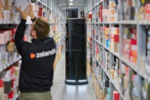
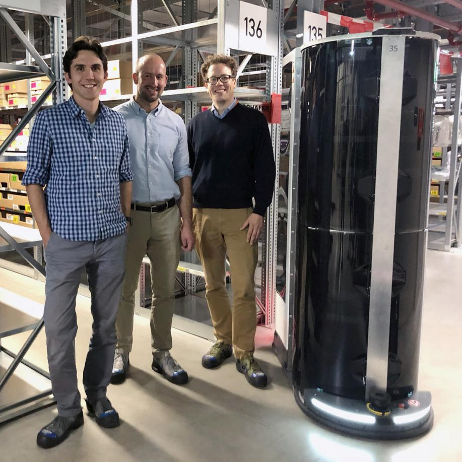

# Zalando tests mobile picking robots

**A  test project at Zalando with [Magazino’s mobile picking robot TORU](https://www.magazino.eu/products/toru/?lang=en) has been completed – opening the way for the expansion of the robot fleet and the move to a larger operational area are on the agenda.**

At the [test site in Erfurt](https://corporate.zalando.com/en/newsroom/en/stories/zalando-welcomes-logistics-robot-toru-erfurt), the robots were deployed parallel to humans within the Zalando warehouse and responsible for the autonomous storage and retrieval of shoe boxes in shelving racks.

“We were able to exceed the requirements in all areas. What makes us particularly happy is that the hard work of the past weeks has paid off so clearly,” said Markus Ruder, project manager at Magazino.

Carl-Friedrich zu Knyphausen, head of logistics development at Zalando, said: “After various assignments in Pick and Stow, the robots have clearly proven themselves in our logistics test environment.”

The two robots from the Erfurt logistics centre will now be deployed at Zalando’s Lahr site in southern Germany and will be reinforced by six more TORU robots in the course of this summer. The robots will initially be put into operation in a separated part of the shoe area within the warehouse where they will be trained. In a second step, the robots will be connected to the warehouse management system.

Laser scanners and 3D sensor technology at the front and rear enable the autonomous robots to safely support the employees in their activities while operating in parallel. If TORU registers an employee or an obstacle on its route, it first slows down, stops in time and waits – or searches for an alternative route if the route remains blocked.

In 2018 Zalando put the first TORU robots into operation in Erfurt in 2018. The robots support storage and picking of shoe boxes.

In contrast to other automation technologies, in which only entire load carriers such as pallets or crates can be moved, the mobile TORU robots use artificial intelligence as well as 3D camera technology to recognise, grasp and transport individual objects.

---
Original: https://www.logisticsmanager.com/zalando-tests-mobile-picking-robots/

_Published Friday 30 August 2019 2:46 pm_
